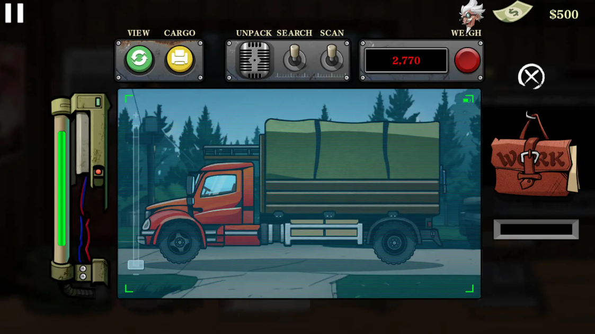

🎮 Zombie Border Patrol APK – Survive, Shoot, and Defend!
---------------
Get ready for the ultimate mix of action, survival, and tower defense with Zombie Border Patrol APK! Developed by DeadByte Studios and available for Android devices, this game drops you into a world on the edge of collapse where you must defend humanity’s last stronghold from waves of relentless zombies. With strategic gameplay and pulse-pounding missions, Zombie Border Patrol is a must-try for fans of survival games.
>Download: [Zombie Border Patrol APK](https://apkmodjoy.net/zombie-border-patrol/)
---------------

⚔️ Storyline / Objectives
---------------
In a post-apocalyptic future, the last survivors have built a massive border to keep the undead at bay. You are part of an elite patrol unit tasked with holding that line at all costs. Your mission: eliminate incoming threats, manage resources, and keep the walls standing through increasingly intense nights.

🕹️ Gameplay
---------------
Zombie Border Patrol offers dynamic 2D tower defense gameplay with base-building elements. Control is simple—tap, drag, and shoot—but decision-making is everything. Choose between PvE survival mode or co-op missions with friends. Each level increases in difficulty and requires better planning, faster reactions, and smarter upgrades.

🎨 Graphics & Sound
---------------
Featuring stylish 2D pixel-art graphics and fluid animations, the game delivers a retro-apocalypse feel with a modern twist. Explosive sound effects and haunting background music keep you fully immersed in the tension.

🛠️ Key Features
---------------
* Customizable characters & weapon loadouts
* Dynamic weather and day/night cycles
* Upgradeable towers, turrets, and defenses
* Unique zombie types with different behaviors

⚙️ Requirements
---------------
* File Size: \~150MB
* Requires Android 6.0 or higher
* Available via APK download (Google Play coming soon)

💬 Pros & Cons
---------------
✔ Fun, addictive gameplay
✔ Strategic depth in upgrading and defense
✘ Limited storyline cutscenes
✘ Some stages may feel repetitive without updates

🌟 Personal Review
---------------
An exciting pick for fans of survival shooters. It’s easy to learn, hard to master, and super satisfying when you survive a full night!

📝 Conclusion
---------------
Zombie Border Patrol APK is perfect for those who love defense games with action-packed intensity. Whether solo or with friends, this game offers hours of zombie-blasting fun.

📥 CTA
---------------
Ready to defend the last wall? Download Zombie Border Patrol APK now and join the resistance!
